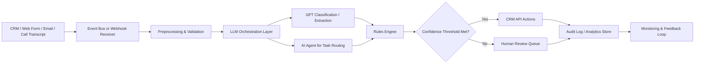

---
title: AI CRM Automation Workflow
repo: ai-business-playbooks
primary_keyword: Business Automation
secondary_keywords:
- Enterprise AI
- GPT
- AI Agents
slug: ai-crm-automation-workflow
word_count_target: 1200
commit_type: 'feat(ai):'---

# AI CRM Automation Workflow for Business Automation

## Introduction

**Business Automation** is one of the highest-return use cases for AI in sales and customer operations. A well-designed AI CRM automation workflow can reduce manual data entry, improve lead response times, and help sales teams prioritize the right accounts. For founders and CTOs, the goal is not to replace the CRM, but to make it more intelligent, faster, and more consistent.

In practice, AI CRM automation combines event-driven workflows, **Enterprise AI** controls, and task-specific **AI Agents** to update records, summarize interactions, score leads, and route opportunities. With GPT-based language models, teams can turn unstructured emails, call transcripts, and web form submissions into structured CRM actions.

This article explains how to design an AI CRM automation workflow that is reliable, measurable, and suitable for production use.

## Problem Statement

Most CRM systems fail not because they lack features, but because the data inside them is incomplete, stale, or inconsistent. Sales reps often spend too much time on administrative work: logging notes, updating deal stages, classifying leads, and writing follow-up emails. As a result, the CRM becomes a reporting tool instead of an operational system.

Common failure points include:

- Lead forms arrive without proper qualification fields
- Sales calls are not summarized or tagged consistently
- Follow-up tasks are delayed or forgotten
- Duplicate accounts and contacts accumulate
- Managers lack accurate pipeline visibility
- Automation rules are too rigid to handle real customer context

A basic rules engine can handle simple triggers, but it breaks down when the input is messy or ambiguous. For example, an inbound email may indicate buying intent, a support issue, or a partnership request. A static workflow cannot interpret nuance well enough to route it correctly.

This is where **Business Automation** with GPT and AI Agents becomes valuable. The system must understand language, classify intent, extract entities, and take action in the CRM while preserving auditability and control.

## Solution

The solution is to build an AI CRM automation workflow with four layers:

1. **Ingestion layer**  
   Capture events from web forms, emails, calendar invites, chat tools, call transcripts, and product usage signals.

2. **AI interpretation layer**  
   Use GPT or another LLM to summarize content, classify intent, extract fields, and identify next actions.

3. **Workflow orchestration layer**  
   Route the output through deterministic business rules, human approval steps, and CRM API actions.

4. **Governance layer**  
   Log every AI decision, monitor accuracy, and restrict actions based on confidence thresholds and role permissions.

A practical implementation might look like this:

- A lead submits a demo request
- The system enriches the lead with firmographic data
- GPT classifies the lead as enterprise, SMB, or partner
- An AI Agent assigns the record to the right owner
- The CRM creates a task for follow-up within 15 minutes
- A personalized email draft is generated and queued for review
- The pipeline stage is updated only if confidence exceeds a defined threshold

The key design principle is separation of concerns. GPT should interpret and draft, but deterministic services should enforce business logic. That keeps the workflow robust and compliant.

## Architecture or Framework

A production-grade AI CRM automation workflow should be event-driven and observable. A useful reference architecture is shown below.

### Core components

**1. Event receiver**  
Use webhooks or message queues to capture CRM events and external signals. Kafka, SQS, Pub/Sub, or a lightweight job queue can work depending on scale.

**2. Preprocessing service**  
Normalize text, remove signatures, deduplicate records, and validate schema. This stage should also detect sensitive data and mask it before LLM processing.

**3. LLM orchestration**  
Use GPT for:
- lead intent classification
- contact and company entity extraction
- call or email summarization
- follow-up email drafting
- opportunity risk detection

Keep prompts short, structured, and versioned. Output should be JSON, not free-form prose, whenever possible.

**4. AI Agents**  
AI Agents can manage multi-step workflows such as:
- looking up account history
- checking open opportunities
- selecting the correct sales playbook
- creating tasks and reminders
- escalating edge cases to a human

Agents should be constrained by tool permissions and timeouts. They should not be allowed to take arbitrary CRM actions.

**5. Rules engine**  
Apply deterministic rules after AI interpretation. Examples:
- If lead score > 80 and company size > 500, route to enterprise sales
- If support sentiment is negative, create a priority follow-up task
- If duplicate match confidence > 95%, merge only after review

**6. Audit and analytics**  
Store prompts, outputs, actions, confidence scores, and human overrides. This is essential for debugging and for building trust with sales leadership.

A strong framework for implementation often includes:
- API gateway for secure intake
- workflow engine such as Temporal, Step Functions, or n8n
- LLM service wrapper for GPT calls
- CRM integration layer for Salesforce, HubSpot, or Dynamics
- observability stack for logs, traces, and evaluation metrics

## Benefits

A well-executed AI CRM automation workflow delivers measurable business value.

### Faster response times
Inbound leads can be routed and replied to within minutes instead of hours. In many sales organizations, speed-to-lead is strongly correlated with conversion rate.

### Better data quality
AI can extract structured fields from messy inputs, reducing missing values in CRM records. This improves forecasting and segmentation.

### Higher rep productivity
Sales reps spend less time on note-taking and data entry. That frees up time for discovery calls, account planning, and closing.

### More consistent execution
GPT-generated summaries and AI Agent-driven task creation help standardize follow-up across teams and regions.

### Improved pipeline visibility
Managers get cleaner data on stage progression, lead source, and deal risk. That supports more accurate forecasting.

### Scalable operations
As volume grows, the same workflow can process more leads and interactions without requiring linear headcount growth.

For leadership teams, the most important metrics are:
- lead response time
- task completion rate
- CRM field completeness
- conversion rate by lead source
- human override percentage
- false positive and false negative rates in classification

## Challenges

AI CRM automation is useful, but it introduces operational risk if implemented poorly.

### Hallucinations and incorrect actions
LLMs can misclassify intent or invent details. Never let the model directly write critical CRM fields without validation.

### Data privacy and compliance
CRM data often contains personal and commercial information. Use access controls, encryption, retention policies, and redaction before sending data to GPT.

### Prompt drift and versioning
Prompt changes can alter output quality. Version prompts, test them against a benchmark set, and track regressions.

### Integration fragility
CRM APIs, webhooks, and third-party enrichment tools can fail or change schemas. Build retries, dead-letter queues, and idempotent writes.

### Over-automation
Too much automation can frustrate sales teams if it creates noise or incorrect assignments. Add review queues for low-confidence cases.

### Change management
Users may distrust AI-generated updates unless they can see why a decision was made. Explainability and audit logs are essential for adoption.

A practical rule is to automate only the actions that are reversible or low risk at first, such as note summarization, task creation, and lead routing. Save high-impact actions like stage changes or account merges for later phases with stronger controls.

## Future Opportunities

The next wave of **Enterprise AI** in CRM will move beyond simple automation into adaptive revenue operations.

### Predictive account orchestration
Systems will combine CRM history, product usage, and communication signals to recommend the next best action for each account.

### Multi-agent sales operations
Specialized **AI Agents** may handle enrichment, routing, forecasting, and renewal risk separately, then coordinate through a shared workflow engine.

### Real-time conversation intelligence
GPT-based assistants will analyze live calls and suggest objections handling, competitor mentions, and follow-up actions in real time.

### Personalized account planning
AI can generate account plans based on industry, deal stage, and stakeholder map, reducing prep time for strategic accounts.

### Closed-loop learning
Future systems will use outcome data to improve lead scoring, routing, and email generation automatically. This requires strong feedback pipelines and evaluation datasets.

### Deeper CRM-native copilots
Instead of external tools, AI will be embedded directly into CRM surfaces, making suggestions context-aware and easier to approve.

For founders and CTOs, the opportunity is to build a workflow that learns from outcomes while remaining safe enough for enterprise use.

## Conclusion

An AI CRM automation workflow is one of the most practical applications of **Business Automation**. When designed correctly, it reduces manual work, improves data quality, and helps sales teams act faster. The best systems combine GPT for language understanding, AI Agents for multi-step tasks, and deterministic rules for control.

The implementation should be event-driven, auditable, and confidence-aware. Start with low-risk workflows such as summarization, lead classification, and task creation. Then expand into routing, enrichment, and assistant-driven follow-up once the metrics are stable.

For technology leaders, the goal is not just automation. It is building a reliable operating system for revenue teams that scales with the business.

## Related Reading

- (pending)