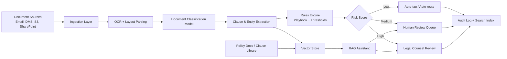

---
title: AI Document Processing for Legal
repo: ai-business-playbooks
primary_keyword: Enterprise AI
secondary_keywords:
- RAG
- Machine Learning
- Business Automation
slug: ai-document-processing-for-legal
word_count_target: 1200
commit_type: 'feat(ai):'---

# AI Document Processing for Legal

## Introduction

Legal teams handle contracts, pleadings, discovery packets, compliance filings, and due diligence materials that are too large and too repetitive for manual review alone. **Enterprise AI** can reduce this burden by classifying documents, extracting clauses, flagging risks, and routing work to the right reviewer with measurable consistency.

For founders, CTOs, and legal operations leaders, the value is not just speed. The real advantage is turning unstructured legal content into structured data that supports search, review, reporting, and downstream workflows. When implemented correctly, AI document processing for legal can improve turnaround time, reduce outside counsel spend, and create a more auditable review trail.

## Problem Statement

Legal document workflows fail for predictable reasons:

1. **High volume, low differentiation**: Many documents are similar in format but different in meaning, making manual review repetitive.
2. **Fragmented sources**: Files arrive through email, shared drives, DMS platforms, and e-signature tools.
3. **Inconsistent terminology**: The same clause may appear under different labels across jurisdictions or counterparties.
4. **Risk of human error**: Missing a termination clause, renewal date, indemnity cap, or confidentiality exception can create material exposure.
5. **Poor searchability**: PDFs and scans often contain text that is hard to query reliably.

A legal team may need to review 5,000 vendor contracts for change-of-control clauses or 20,000 discovery files for privileged content. Without automation, cycle times expand and quality varies by reviewer. **Business Automation** helps, but only if the system can understand document type, extract fields, and preserve evidence for audit.

## Solution

A practical AI document processing for legal program should combine deterministic rules, **Machine Learning**, and retrieval-based workflows. The goal is not fully autonomous legal judgment. It is assisted processing with human review at the points of highest risk.

Core capabilities:

- **Document classification**: identify NDAs, MSAs, DPAs, employment agreements, court filings, and exhibits.
- **OCR and text normalization**: convert scans and images into searchable text.
- **Clause extraction**: pull out governing law, liability caps, assignment, renewal, termination, and data processing terms.
- **Risk scoring**: assign review priority based on missing terms or deviations from playbook language.
- **RAG for legal search**: answer questions using approved policy docs, clause libraries, and prior precedent.
- **Workflow routing**: send high-risk documents to counsel and routine items to operations staff.

A strong implementation pattern is:

1. Ingest documents from source systems.
2. Run OCR and layout parsing.
3. Classify document type and jurisdiction.
4. Extract fields and clauses.
5. Compare extracted text against legal playbooks.
6. Route exceptions to human reviewers.
7. Store results in a searchable index and audit log.

This approach works well because it separates extraction from interpretation. **RAG** is especially useful for retrieving internal policy language, fallback clauses, and prior approved positions without exposing the model to uncontrolled sources.

## Architecture or Framework

A reliable architecture for legal document processing should be modular and auditable.

Recommended stack:

- **OCR**: Azure AI Document Intelligence, AWS Textract, or Google Document AI for scanned PDFs and forms.
- **Layout parsing**: detect tables, headers, footers, and signature blocks.
- **Classification**: fine-tuned transformer model or light gradient-boosted classifier using labeled document metadata.
- **Extraction**: span-based NLP, regex for stable fields, and document-layout models for clause locations.
- **Vector database**: store embeddings for clauses, precedent, and policy documents.
- **RAG layer**: answer reviewer questions such as “What is our fallback for unlimited indemnity?” using approved sources only.
- **Rules engine**: encode legal thresholds, e.g., “flag if liability cap is absent or below 12 months fees.”
- **Audit logging**: record model version, source text, confidence score, reviewer decision, and timestamp.

A practical framework is to use **Machine Learning** for probabilistic tasks, rules for hard policy checks, and RAG for controlled knowledge retrieval. This reduces hallucination risk while keeping the system useful for attorneys and legal ops teams.

## Benefits

The business case for Enterprise AI in legal document processing is measurable.

- **Faster review cycles**: teams can process large batches in hours instead of days.
- **Lower review cost**: routine extraction and triage can reduce outside counsel dependency.
- **Better consistency**: the same clause is evaluated against the same playbook every time.
- **Improved visibility**: leadership can track open risk items by contract type, business unit, or jurisdiction.
- **Searchable precedent**: approved clauses and prior decisions become reusable institutional knowledge.
- **Scalable onboarding**: new reviewers can work from the system’s extracted fields and recommendations.

Useful metrics to track:

- document classification accuracy
- clause extraction precision and recall
- average review time per document
- percentage of documents auto-routed
- exception rate by contract type
- reviewer override rate
- time to first pass review
- outside counsel spend reduction

For many teams, a 30–50% reduction in manual triage time is realistic if the document set is standardized and the playbook is well defined.

## Challenges

Legal use cases are demanding because the cost of error is high.

### 1. OCR quality on poor scans
Low-resolution scans, handwritten notes, and complex tables can reduce extraction accuracy. Mitigation: pre-processing, confidence thresholds, and manual fallback for low-quality pages.

### 2. Clause variation across templates
A single legal concept may appear in many forms. Mitigation: train on internal templates, use embeddings for semantic matching, and maintain a clause taxonomy.

### 3. Hallucination risk in generative AI
A model may summarize a clause incorrectly or invent missing terms. Mitigation: restrict generative outputs to cited sources, use RAG, and require extracted evidence snippets.

### 4. Data privacy and privilege
Legal content often includes confidential or privileged material. Mitigation: encryption, access controls, tenant isolation, redaction, and strict retention policies.

### 5. Reviewability and auditability
Legal stakeholders need to know why a document was flagged. Mitigation: store the exact text span, confidence score, and rule triggered for every decision.

### 6. Change management
Attorneys may distrust automation if it is opaque. Mitigation: start with low-risk use cases such as metadata tagging, then expand to clause review and exception routing.

Enterprise AI succeeds in legal only when the workflow is transparent enough for counsel to validate and override decisions quickly.

## Future Opportunities

The next phase of AI document processing for legal will move from extraction to decision support.

- **Adaptive playbooks**: systems will learn which fallback clauses are accepted by specific counterparties or jurisdictions.
- **Cross-document reasoning**: AI will compare related agreements, amendments, and exhibits to identify conflicts.
- **Proactive risk alerts**: contract repositories will surface obligations, expirations, and renewal windows before they become issues.
- **Agent-assisted review**: AI agents will gather missing documents, draft exception summaries, and prepare redline suggestions.
- **Deeper Enterprise AI integration**: legal, procurement, finance, and sales systems will share a common document intelligence layer.
- **Better governance**: model cards, policy checks, and approval workflows will become standard for legal AI deployments.

The strongest opportunity is not replacing legal judgment. It is creating a system where legal expertise is captured once and applied consistently across thousands of documents.

## Conclusion

AI document processing for legal is one of the clearest high-value use cases for Enterprise AI. It combines structured extraction, controlled retrieval, and workflow automation to reduce manual effort while preserving review quality.

The best implementations are narrow, measurable, and auditable. Start with a defined document class, a clear playbook, and human review for exceptions. Use **RAG** for approved knowledge retrieval, **Machine Learning** for classification and extraction, and **Business Automation** for routing and reporting. That combination delivers real operational value without compromising legal oversight.

## Related Reading

- (pending)