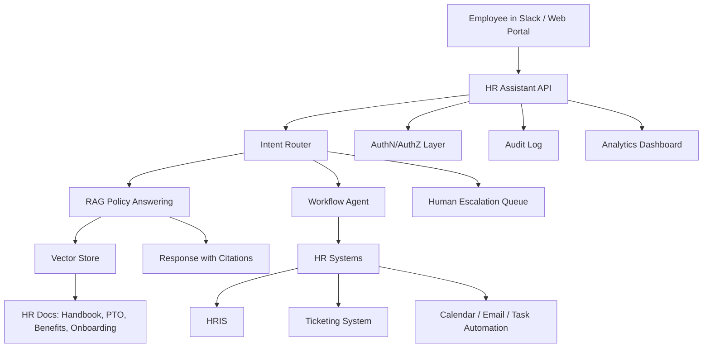

---
title: AI HR Assistant for Startups
repo: ai-business-playbooks
primary_keyword: Enterprise AI
secondary_keywords:
- AI Agents
- Business Automation
- Machine Learning
slug: ai-hr-assistant-for-startups
word_count_target: 1200
commit_type: 'feat(ai):'---

# AI HR Assistant for Startups

## Introduction

For startups, HR work grows faster than the team that manages it. Founders and early operators spend hours answering repetitive employee questions, scheduling onboarding, routing policy requests, and keeping track of forms. An **Enterprise AI**-based HR assistant can reduce that burden by handling common requests with consistent, policy-aware responses.

An AI HR assistant for startups is not just a chatbot. It is an internal service layer that combines **AI Agents**, document retrieval, workflow automation, and approval logic to support HR operations. When designed well, it can improve response times, reduce manual errors, and create a more reliable employee experience without requiring a large HR team.

This article explains how to design an AI HR assistant for startups, what problems it solves, and how to implement it safely in an enterprise context.

## Problem Statement

Startups usually face a predictable set of HR problems:

1. **Repeated employee questions**  
   Questions about PTO, payroll dates, benefits, remote-work policies, and onboarding steps appear daily. HR teams answer the same questions many times.

2. **Fragmented knowledge**  
   Policies live in Notion, Google Drive, Slack, PDFs, and email threads. Employees do not know where to look, and answers often vary by source.

3. **Manual workflows**  
   Updating employee records, creating onboarding checklists, routing approvals, and sending reminders are often done manually.

4. **Inconsistent policy enforcement**  
   Different managers may interpret policies differently. This creates confusion and compliance risk.

5. **Limited HR bandwidth**  
   Startups rarely have a full HR operations team. The founder, office manager, or people ops lead becomes the default help desk.

These problems make HR a strong candidate for **Business Automation**. However, a simple FAQ bot is not enough. A startup needs a system that can understand context, retrieve current policy documents, and safely execute workflows. That is where **Enterprise AI** becomes useful.

## Solution

The best approach is to build an AI HR assistant around three capabilities:

- **Answering questions from trusted sources**
- **Executing routine HR workflows**
- **Escalating sensitive issues to humans**

A practical implementation uses retrieval-augmented generation (RAG) for policy answers, **AI Agents** for task execution, and **Machine Learning** only where it adds measurable value, such as intent classification or document routing.

### Core use cases

An AI HR assistant for startups should handle:

- PTO and leave policy questions
- Benefits enrollment instructions
- Onboarding checklists
- Employee handbook navigation
- Payroll calendar questions
- Request routing for HR approvals
- Document collection reminders
- Offboarding task coordination

### Design principles

1. **Source-of-truth first**  
   The assistant should answer only from approved documents and systems.

2. **Action with guardrails**  
   It can create tickets, send reminders, or update records, but only through approved workflows.

3. **Human escalation for exceptions**  
   Anything involving legal risk, compensation changes, harassment, or termination should be routed to HR or leadership.

4. **Auditability**  
   Every answer and action should be logged with source references and timestamps.

5. **Role-aware access**  
   Managers should see different data than employees. Sensitive records must be permissioned.

## Architecture or Framework

A robust startup HR assistant can be built with a layered architecture.

### 1. Interface layer

Employees interact through Slack, Microsoft Teams, or a web portal. For startups, Slack is often the fastest adoption path because it matches how teams already communicate.

### 2. Authentication and authorization

Before responding, the assistant checks identity and role. This matters for:
- employee-only information
- manager-only approvals
- confidential HR cases

Use SSO if available. At minimum, map Slack user IDs to employee records.

### 3. Intent router

The router classifies incoming requests into categories such as:
- policy question
- workflow request
- sensitive issue
- unknown

This can be implemented with simple rules plus a lightweight classifier. **Machine Learning** is useful here if the startup has enough historical data, but many teams can start with deterministic rules and improve later.

### 4. RAG policy answering

For policy questions, the assistant should not “invent” answers. It should retrieve relevant passages from:
- employee handbook
- benefits documents
- PTO policy
- onboarding guides
- compliance docs

Then it generates a response with citations. For example:

- “PTO accrues at 1.5 days per month for full-time employees.”
- “New hires must complete tax forms within three business days.”

This keeps the assistant grounded in approved content.

### 5. Workflow agent

For operational tasks, an **AI Agents** layer can orchestrate actions:
- create onboarding tasks
- send reminders for missing documents
- open HR tickets
- schedule manager reviews
- notify payroll of status changes

A workflow agent should not directly access every system. Instead, it should call narrowly scoped tools such as:
- `create_hr_ticket()`
- `send_onboarding_checklist()`
- `lookup_employee_status()`
- `schedule_meeting()`

### 6. Human escalation

If the request includes ambiguous policy interpretation, legal risk, or personal conflict, the assistant should stop and escalate. Examples:
- “Can I fire someone without notice?”
- “How do we handle a harassment complaint?”
- “Can we change this employee’s salary retroactively?”

These should never be answered autonomously.

### 7. Logging and analytics

Track:
- resolution rate
- average response time
- escalation rate
- top request categories
- policy document gaps
- failed workflow executions

These metrics show whether the assistant is actually reducing HR load.

## Benefits

A well-designed AI HR assistant delivers practical value quickly.

### Faster employee support

Employees get immediate answers instead of waiting for HR to respond. This is especially important for distributed teams across time zones.

### Lower operational overhead

Routine questions and reminders are automated, freeing HR and founders to focus on hiring, retention, and culture.

### Better policy consistency

Because responses come from approved documents, the assistant reduces conflicting interpretations.

### Scalable onboarding

New hires can get step-by-step guidance, document reminders, and task progress updates without manual follow-up.

### Improved visibility

Analytics reveal which policies are unclear, which workflows break most often, and where HR documents need revision.

### Stronger enterprise readiness

Even early-stage startups benefit from **Enterprise AI** practices such as access control, audit trails, and human approval gates. These controls make it easier to grow without rebuilding the system later.

## Challenges

Building an AI HR assistant for startups also introduces real risks.

### Policy drift

If documents are outdated, the assistant will return outdated answers. The system needs a document ownership process and review cadence.

### Hallucinations

Generative models can produce plausible but incorrect responses. RAG reduces this risk, but only if the assistant is constrained to trusted sources.

### Access control complexity

HR data is sensitive. A startup may underestimate how much permissioning is needed until the assistant exposes confidential information.

### Workflow reliability

If the assistant creates tasks or sends messages automatically, failures can affect onboarding and payroll operations. Tool calls need retries, idempotency, and monitoring.

### Change management

Employees may not trust the assistant at first. HR should publish what it can and cannot do, and where humans remain responsible.

### Compliance and legal exposure

Labor laws, privacy rules, and employment regulations vary by region. The assistant must be configured to avoid giving legal advice or making unsupported decisions.

## Future Opportunities

Once the core assistant is stable, startups can expand its role.

### Proactive HR operations

Instead of waiting for questions, the assistant can detect events and act:
- remind employees about expiring documents
- notify managers of onboarding milestones
- flag incomplete compliance tasks

### Personalized employee experiences

The assistant can tailor guidance based on role, location, and tenure. For example, a contractor in one country may see different onboarding steps than a full-time employee in another.

### Better integration with HRIS and payroll

Deeper integration with systems like BambooHR, Rippling, Deel, Gusto, or Workday can reduce duplicate entry and improve data accuracy.

### Smarter document intelligence

More advanced **Machine Learning** can classify policy documents, detect duplicates, and identify stale content that needs review.

### Multi-agent HR operations

A future version may use multiple specialized **AI Agents**:
- one for onboarding
- one for policy support
- one for ticket triage
- one for compliance reminders

This modular design can improve maintainability as the startup grows.

## Conclusion

An AI HR assistant for startups is one of the most practical uses of **Enterprise AI** because it addresses a constant operational pain point with clear ROI. By combining **AI Agents**, **Business Automation**, and selective **Machine Learning**, startups can build a system that answers policy questions, executes routine workflows, and escalates sensitive issues safely.

The best implementation starts small: focus on a few high-volume HR tasks, connect trusted documents, add permission controls, and measure resolution quality. If the assistant reduces HR response time, improves onboarding consistency, and lowers manual follow-up, it is already creating value. From there, startups can expand into more advanced automation without sacrificing control or compliance.

## Related Reading

- (pending)