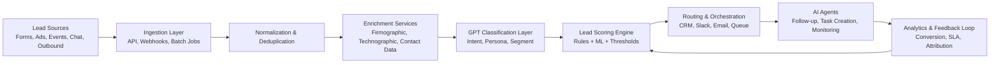

---
title: AI Lead Generation Pipeline
repo: ai-business-playbooks
primary_keyword: Enterprise AI
secondary_keywords:
- AI Agents
- GPT
- Business Automation
slug: ai-lead-generation-pipeline
word_count_target: 1200
commit_type: 'feat(ai):'---

# AI Lead Generation Pipeline for Enterprise AI Teams

## Introduction

An **AI lead generation pipeline** helps teams identify, qualify, enrich, and route prospects with less manual effort and more consistency. For organizations building **Enterprise AI** capabilities, this is not just a marketing upgrade; it is a revenue operations system that connects data, models, and workflows across sales and marketing.

The strongest implementations combine **AI Agents** for autonomous task execution, **GPT** models for language understanding and content generation, and **Business Automation** for routing, CRM updates, and follow-up actions. The goal is to create a measurable pipeline that improves lead response time, lead scoring accuracy, and conversion rates without increasing headcount.

This article outlines a practical framework for building an AI lead generation pipeline that can be deployed in enterprise environments with governance, observability, and clear business outcomes.

## Problem Statement

Traditional lead generation pipelines are fragmented. Marketing captures leads from forms, events, ads, and outbound campaigns, but qualification often depends on manual review or rigid scoring rules. Sales teams then spend time sorting low-intent contacts from high-value prospects, while operations teams struggle to keep CRM records clean and current.

Common failure points include:

- Slow response times after form submission
- Inconsistent lead scoring across channels
- Poor data enrichment from third-party sources
- Duplicate or incomplete CRM records
- Weak handoff between marketing and sales
- Limited visibility into conversion performance by source or segment

For Enterprise AI teams, the challenge is not simply generating more leads. It is designing a pipeline that can process large volumes of inbound and outbound signals, apply policy-based qualification, and trigger the right next action with auditability. Without this, teams end up with brittle automations, unreliable scoring, and low trust from sales leaders.

## Solution

A modern AI lead generation pipeline should operate as a sequence of coordinated stages:

1. **Capture**
   - Collect leads from web forms, chat, events, email replies, ad platforms, and outbound prospecting tools.
   - Normalize source metadata immediately.

2. **Enrich**
   - Use enrichment APIs and internal data sources to append firmographic, technographic, and contact-level details.
   - Resolve company domains, roles, industry, employee count, and geography.

3. **Classify**
   - Apply GPT-based classification to detect intent, segment, and persona.
   - Use rules and model outputs together rather than relying on one or the other.

4. **Score**
   - Combine behavioral signals, enrichment data, and model predictions into a lead score.
   - Weight high-intent actions such as pricing-page visits, demo requests, and repeated engagement.

5. **Route**
   - Send leads to the correct owner, queue, or sequence based on territory, account tier, or product line.
   - Trigger slack alerts, CRM task creation, or SDR assignment.

6. **Respond**
   - Generate personalized first-touch messages using GPT with approved templates and brand constraints.
   - Use AI Agents to schedule follow-ups, update records, and monitor replies.

7. **Measure**
   - Track conversion by source, speed-to-lead, score calibration, and downstream pipeline contribution.
   - Feed outcomes back into scoring and routing logic.

This design works best when the pipeline is event-driven and modular. Each stage should be independently testable, observable, and replaceable.

## Architecture or Framework

A reliable AI lead generation pipeline can be implemented as a layered framework:

### Recommended implementation stack

- **Ingestion**
  - Webhooks from forms and chat tools
  - Batch sync from event platforms and ad systems
  - Queue-based transport such as Kafka, SQS, or Pub/Sub

- **Data layer**
  - CRM as system of record
  - Warehouse for analytics and model evaluation
  - Feature store if scoring uses reusable signals at scale

- **Model layer**
  - GPT for lead classification, summarization, and message drafting
  - Lightweight ML models for scoring prediction
  - Rules engine for compliance and business constraints

- **Orchestration**
  - Workflow engine such as Temporal, Airflow, or a serverless state machine
  - AI Agents for multi-step tasks like enrichment retries, owner assignment, and follow-up tracking

- **Governance**
  - Prompt versioning
  - Human approval for high-risk actions
  - Audit logs for every model decision
  - PII redaction and access controls

### Example workflow

A lead submits a demo request from a high-value account:

1. The form webhook creates an event.
2. The ingestion service checks for duplicates and merges records.
3. Enrichment adds company size, industry, and account tier.
4. GPT classifies the message as high-intent enterprise interest.
5. The scoring engine assigns a score above the sales threshold.
6. Routing assigns the lead to the enterprise SDR queue.
7. An AI Agent drafts a personalized email and creates a CRM task.
8. Analytics records speed-to-lead, response status, and eventual opportunity creation.

### Design principles

- Keep deterministic logic for compliance and routing thresholds.
- Use GPT where language interpretation or personalization is required.
- Separate scoring from messaging so model failures do not block the pipeline.
- Make every decision explainable to sales and operations teams.
- Prefer asynchronous execution for enrichment and follow-up tasks.

## Benefits

A well-built AI lead generation pipeline produces operational and financial benefits across the revenue team.

### Faster response times
Automated capture, enrichment, and routing reduce the time between lead submission and first contact. In many organizations, improving speed-to-lead from hours to minutes materially increases conversion rates.

### Better lead quality
Combining enrichment with GPT classification improves qualification beyond basic form fields. Teams can distinguish between student inquiries, vendor outreach, and genuine enterprise buyers.

### Higher sales productivity
Sales development representatives spend less time researching leads and more time engaging qualified prospects. This improves meetings booked per rep and lowers administrative overhead.

### More consistent scoring
A hybrid scoring model based on rules, model outputs, and historical conversion data is more stable than manual judgment alone. It also helps reduce bias and regional inconsistency.

### Scalable personalization
**GPT** can generate tailored outreach based on industry, use case, and recent engagement. This makes first-touch communication more relevant without requiring manual drafting for every lead.

### Stronger operational control
Enterprise teams need traceability. Logging every enrichment call, model output, and routing decision makes the system auditable and easier to improve.

## Challenges

Building this system in an enterprise environment introduces real constraints.

### Data quality
Poor source data, duplicate records, and missing company domains can degrade every downstream step. Deduplication and normalization must happen early.

### Model reliability
GPT outputs can vary across prompts and model versions. For production use, prompts must be tested, versioned, and constrained with structured output schemas.

### Compliance and privacy
Lead data often contains personal information. Teams must handle consent, retention, access control, and regional privacy requirements carefully. PII should be minimized in prompts and logs.

### Integration complexity
CRM, marketing automation, enrichment vendors, and analytics tools rarely share the same data model. Integration failures can create broken workflows or stale records.

### False positives in scoring
Over-aggressive scoring can flood sales with low-quality leads. Teams should monitor precision, not just volume, and calibrate thresholds using downstream conversion data.

### Organizational trust
Sales teams may distrust automated routing or AI-generated outreach if the logic is opaque. Clear explanations, sample reviews, and rollback procedures are essential.

## Future Opportunities

The next generation of AI lead generation pipeline systems will become more adaptive and autonomous.

### Multi-agent coordination
**AI Agents** can specialize in enrichment, qualification, follow-up, and renewal detection. A coordinator agent can delegate tasks and monitor completion across systems.

### Real-time intent detection
Instead of waiting for form submissions, pipelines can detect buying signals from website behavior, email engagement, and account-level activity in near real time.

### Closed-loop optimization
Future systems will automatically adjust scoring weights and routing policies based on conversion outcomes, not just static rules. This creates a feedback loop between operations and revenue performance.

### Deeper personalization
With better context, GPT can generate messaging that reflects industry pain points, product usage, and account history. This should be paired with approval workflows to prevent brand drift.

### Cross-functional automation
**Business Automation** will extend beyond lead handling into meeting scheduling, proposal generation, and account handoff. That reduces friction between marketing, sales, and customer success.

## Conclusion

An effective AI lead generation pipeline is a practical Enterprise AI use case with direct revenue impact. The best systems do not rely on a single model or a fully autonomous agent. They combine deterministic rules, GPT-based language understanding, enrichment services, and workflow automation to create a fast, auditable, and scalable process.

For founders and technology leaders, the priority is to start with a narrow use case, such as inbound demo requests or event leads, and measure outcomes like speed-to-lead, qualification accuracy, and conversion rate. Once the pipeline proves value, expand into outbound prospecting, account-based routing, and automated follow-up.

The strongest enterprise implementations treat lead generation as an operating system for revenue, not a collection of disconnected tools.

## Related Reading

- (pending)