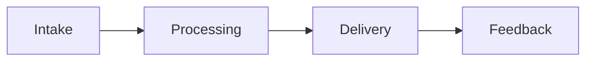

---
title: AI Restaurant Ordering System
repo: ai-business-playbooks
primary_keyword: Business Automation
secondary_keywords:
- AI Agents
- Generative AI
- Machine Learning
slug: ai-restaurant-ordering-system
word_count_target: 1200
commit_type: 'feat(ai):'---

# AI Restaurant Ordering System

## Introduction

This section covers introduction for AI Restaurant Ordering System with focus on Business Automation. Organizations need clear ownership, measurable outcomes, and iterative delivery. Teams should document decisions, validate assumptions with pilots, and align AI Agents, Generative AI, and Machine Learning with business goals. Teams should document decisions, validate assumptions with pilots, and align AI Agents, Generative AI, and Machine Learning with business goals. Teams should document decisions, validate assumptions with pilots, and align AI Agents, Generative AI, and Machine Learning with business goals. Teams should document decisions, validate assumptions with pilots, and align AI Agents, Generative AI, and Machine Learning with business goals. Teams should document decisions, validate assumptions with pilots, and align AI Agents, Generative AI, and Machine Learning with business goals.  The primary focus is **Business Automation**.

## Problem Statement

This section covers problem for AI Restaurant Ordering System with focus on Business Automation. Organizations need clear ownership, measurable outcomes, and iterative delivery. Teams should document decisions, validate assumptions with pilots, and align AI Agents, Generative AI, and Machine Learning with business goals. Teams should document decisions, validate assumptions with pilots, and align AI Agents, Generative AI, and Machine Learning with business goals. Teams should document decisions, validate assumptions with pilots, and align AI Agents, Generative AI, and Machine Learning with business goals. Teams should document decisions, validate assumptions with pilots, and align AI Agents, Generative AI, and Machine Learning with business goals. 

## Solution

This section covers solution for AI Restaurant Ordering System with focus on Business Automation. Organizations need clear ownership, measurable outcomes, and iterative delivery. Teams should document decisions, validate assumptions with pilots, and align AI Agents, Generative AI, and Machine Learning with business goals. Teams should document decisions, validate assumptions with pilots, and align AI Agents, Generative AI, and Machine Learning with business goals. Teams should document decisions, validate assumptions with pilots, and align AI Agents, Generative AI, and Machine Learning with business goals. Teams should document decisions, validate assumptions with pilots, and align AI Agents, Generative AI, and Machine Learning with business goals. Teams should document decisions, validate assumptions with pilots, and align AI Agents, Generative AI, and Machine Learning with business goals. 

## Architecture or Framework

This section covers architecture for AI Restaurant Ordering System with focus on Business Automation. Organizations need clear ownership, measurable outcomes, and iterative delivery. Teams should document decisions, validate assumptions with pilots, and align AI Agents, Generative AI, and Machine Learning with business goals. Teams should document decisions, validate assumptions with pilots, and align AI Agents, Generative AI, and Machine Learning with business goals. Teams should document decisions, validate assumptions with pilots, and align AI Agents, Generative AI, and Machine Learning with business goals. Teams should document decisions, validate assumptions with pilots, and align AI Agents, Generative AI, and Machine Learning with business goals. Teams should document decisions, validate assumptions with pilots, and align AI Agents, Generative AI, and Machine Learning with business goals. Teams should document decisions, validate assumptions with pilots, and align AI Agents, Generative AI, and Machine Learning with business goals. 

## Benefits

This section covers benefits for AI Restaurant Ordering System with focus on Business Automation. Organizations need clear ownership, measurable outcomes, and iterative delivery. Teams should document decisions, validate assumptions with pilots, and align AI Agents, Generative AI, and Machine Learning with business goals. Teams should document decisions, validate assumptions with pilots, and align AI Agents, Generative AI, and Machine Learning with business goals. Teams should document decisions, validate assumptions with pilots, and align AI Agents, Generative AI, and Machine Learning with business goals. Teams should document decisions, validate assumptions with pilots, and align AI Agents, Generative AI, and Machine Learning with business goals. 

## Challenges

This section covers challenges for AI Restaurant Ordering System with focus on Business Automation. Organizations need clear ownership, measurable outcomes, and iterative delivery. Teams should document decisions, validate assumptions with pilots, and align AI Agents, Generative AI, and Machine Learning with business goals. Teams should document decisions, validate assumptions with pilots, and align AI Agents, Generative AI, and Machine Learning with business goals. Teams should document decisions, validate assumptions with pilots, and align AI Agents, Generative AI, and Machine Learning with business goals. Teams should document decisions, validate assumptions with pilots, and align AI Agents, Generative AI, and Machine Learning with business goals. 

## Future Opportunities

This section covers future for AI Restaurant Ordering System with focus on Business Automation. Organizations need clear ownership, measurable outcomes, and iterative delivery. Teams should document decisions, validate assumptions with pilots, and align AI Agents, Generative AI, and Machine Learning with business goals. Teams should document decisions, validate assumptions with pilots, and align AI Agents, Generative AI, and Machine Learning with business goals. Teams should document decisions, validate assumptions with pilots, and align AI Agents, Generative AI, and Machine Learning with business goals. Teams should document decisions, validate assumptions with pilots, and align AI Agents, Generative AI, and Machine Learning with business goals. 

## Conclusion

This section covers conclusion for AI Restaurant Ordering System with focus on Business Automation. Organizations need clear ownership, measurable outcomes, and iterative delivery. Teams should document decisions, validate assumptions with pilots, and align AI Agents, Generative AI, and Machine Learning with business goals. Teams should document decisions, validate assumptions with pilots, and align AI Agents, Generative AI, and Machine Learning with business goals. Teams should document decisions, validate assumptions with pilots, and align AI Agents, Generative AI, and Machine Learning with business goals. 

## Related Reading

- (pending)
