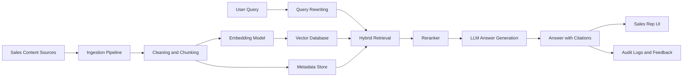

---
title: RAG Knowledge Base for Sales Teams
repo: ai-business-playbooks
primary_keyword: RAG
secondary_keywords:
- Enterprise AI
- Generative AI
- AI Agents
slug: rag-knowledge-base-for-sales-teams
word_count_target: 1200
commit_type: 'feat(ai):'---

# RAG Knowledge Base for Sales Teams

## Introduction

A **RAG** knowledge base for sales teams combines retrieval-augmented generation with structured company knowledge so reps can get accurate answers during prospecting, discovery, objection handling, and proposal writing. Instead of relying on memory, scattered documents, or generic chatbots, sales teams can query a curated system that retrieves the right context from approved sources and uses a language model to generate concise, relevant responses.

For founders and technology leaders, this matters because sales execution depends on speed and consistency. Reps need fast access to product facts, pricing rules, case studies, security answers, competitive positioning, and CRM notes. A well-designed RAG system turns that knowledge into a usable interface for the field without forcing teams to manually search Confluence, Drive, Slack, and CRM records.

## Problem Statement

Sales organizations usually suffer from fragmented knowledge. Product updates live in release notes, objections are stored in call transcripts, pricing exceptions are buried in email, and customer proof points exist in decks that no one can find. The result is predictable:

- reps give inconsistent answers
- managers spend time correcting messaging
- enablement content becomes stale
- new hires ramp slowly
- high-value knowledge is underused

A standard search tool is not enough. Search can find a document, but it does not synthesize an answer. A generic chatbot without retrieval often hallucinates product capabilities, invents pricing details, or cites outdated collateral. For sales use cases, that is unacceptable because one wrong answer can damage trust or create legal and commercial risk.

This is where **RAG** is more effective than a pure Generative AI approach. By grounding responses in verified company sources, the system can produce answers that are both conversational and traceable. It also supports Enterprise AI requirements such as access control, auditability, and source attribution.

## Solution

A sales-focused RAG knowledge base should be built around four design goals:

1. **Accuracy** — answers must come from approved sources
2. **Freshness** — updates should be ingested quickly
3. **Relevance** — retrieval should prioritize the right content for the sales context
4. **Usability** — reps should ask questions in plain language and get immediate answers

Start by defining the highest-value sales workflows:

- prospect research
- discovery prep
- objection handling
- competitive comparisons
- pricing and packaging questions
- security and compliance responses
- follow-up email drafting
- account planning

Then map each workflow to the knowledge sources it needs. A practical source list includes:

- product documentation
- pricing sheets and discount rules
- case studies and customer references
- sales playbooks
- security questionnaires
- competitive battlecards
- CRM notes and call transcripts
- FAQ and support articles

The implementation pattern should be simple and controlled:

- ingest documents from approved repositories
- chunk content by semantic boundaries, not fixed length only
- create embeddings for retrieval
- store metadata such as department, product line, region, version, and access level
- retrieve top-k passages using hybrid search
- rerank results before generation
- generate a short answer with citations
- log the query, retrieved sources, and feedback

For sales teams, citations are not optional. Reps need to know whether an answer came from the pricing policy, the latest product release, or a legacy document that should be ignored. The interface should show source snippets and confidence signals so users can verify the result quickly.

A good operational rule is to keep the system answerable only from trusted content. If the knowledge base does not have enough evidence, the assistant should say so and route the rep to the correct owner rather than guessing.

## Architecture or Framework

A practical **RAG** architecture for a sales knowledge base can be implemented as follows:

### Recommended framework components

- **Ingestion pipeline**: Airflow, Dagster, or a lightweight scheduled job
- **Document parsing**: unstructured.io, Apache Tika, or custom parsers for PDFs and slides
- **Embeddings**: OpenAI embeddings, Cohere, or an open-source model such as bge-large
- **Vector database**: Pinecone, Weaviate, pgvector, or Elasticsearch vector search
- **Reranking**: cross-encoder rerankers to improve precision on sales queries
- **LLM layer**: GPT-class model or enterprise-hosted alternative with guardrails
- **Access control**: role-based filtering by region, segment, or team
- **Observability**: query logs, answer acceptance rate, retrieval precision, and latency

### Suggested retrieval flow

1. Normalize the query: “Can we discount for a 3-year enterprise deal?”
2. Detect intent: pricing policy
3. Apply metadata filters: enterprise, current version, approved policy
4. Retrieve top 20 chunks using hybrid keyword + vector search
5. Rerank to top 5 based on semantic fit
6. Generate answer with direct citations
7. If confidence is low, return a safe fallback and escalation path

### Metrics to track

- answer acceptance rate
- citation coverage percentage
- retrieval precision@k
- hallucination rate
- median response latency
- time saved per rep per week
- ramp time for new hires

These metrics matter because a sales RAG system should not be judged only by model quality. It should be measured by business outcomes such as faster response times, more consistent messaging, and improved conversion support.

## Benefits

A well-built RAG knowledge base creates concrete value across the sales motion.

### Faster rep productivity

Reps can ask one system instead of searching across multiple tools. That reduces context switching and shortens preparation time before calls and demos.

### Better answer consistency

Every rep gets the same approved explanation for pricing, packaging, security, and product scope. This improves message discipline across the organization.

### Faster onboarding

New hires can use the system as a guided knowledge layer while learning the product and sales process. This is especially useful for distributed teams and fast-growing companies.

### Stronger Enterprise AI governance

Because answers are grounded in approved documents, the system can support audit trails, access control, and compliance review. That makes it much easier to deploy in regulated environments.

### More effective use of Generative AI

Generative AI becomes useful when it is constrained by trusted context. Instead of producing generic text, it can draft tailored follow-ups, summarize objections, or prepare account notes with factual grounding.

### Better support for AI Agents

A sales assistant can be extended into an **AI Agents** workflow that performs multi-step tasks: find relevant account history, pull the latest battlecard, draft an email, and create a CRM note. RAG provides the factual backbone for those actions.

## Challenges

A sales RAG system is only as good as its content and controls. The main challenges are operational, not just technical.

### Content quality

If source documents are outdated, contradictory, or poorly written, retrieval will surface bad context. You need content ownership, versioning, and review cycles.

### Access control

Sales content often varies by region, segment, or deal type. A rep should not see restricted pricing or private customer details outside their authorization scope.

### Chunking and retrieval errors

Poor chunking can split important policy statements across fragments. Weak retrieval can return a relevant document but the wrong section. Hybrid search and reranking help reduce this risk.

### Hallucinations

Even with retrieval, the model may infer unsupported claims. Guardrails should require citations and block unsupported answers for sensitive topics like pricing or legal terms.

### Adoption

Reps will not use the system if it is slower than asking a colleague. The interface must be fast, embedded in the tools they already use, and optimized for common questions.

### Maintenance

Knowledge bases decay quickly. Product releases, pricing changes, and new objections require continuous ingestion and validation. Treat the system like a product, not a one-time project.

## Future Opportunities

The next phase of sales RAG goes beyond Q&A.

One opportunity is **context-aware copilots** inside CRM and sales engagement tools. When a rep opens an opportunity, the assistant can automatically surface relevant case studies, objections, and next-step recommendations.

Another opportunity is combining RAG with **AI Agents** that can execute workflows across systems. For example, an agent could detect a competitor in a call transcript, retrieve the latest battlecard, draft a follow-up, and update the CRM record.

A third opportunity is adding personalization. A RAG system can tailor responses by industry, account size, or region so the output is more relevant to the rep’s deal context.

Finally, sales knowledge systems can become part of a broader Enterprise AI platform. The same retrieval layer can support customer success, support, legal, and operations, reducing duplication and improving governance across the company.

## Conclusion

A sales **RAG** knowledge base is one of the most practical ways to apply AI to revenue operations. It solves a real problem: sales teams need fast, trustworthy answers drawn from approved company knowledge. By combining retrieval, metadata filtering, reranking, and grounded generation, leaders can deliver a system that improves rep productivity without sacrificing accuracy.

The key is to treat the project as both a technical and operational system. Choose high-quality sources, enforce access controls, measure retrieval quality, and keep content fresh. When implemented well, the result is not just a smarter search tool. It becomes a reliable sales assistant that supports better conversations, faster onboarding, and more consistent execution.

## Related Reading

- (pending)