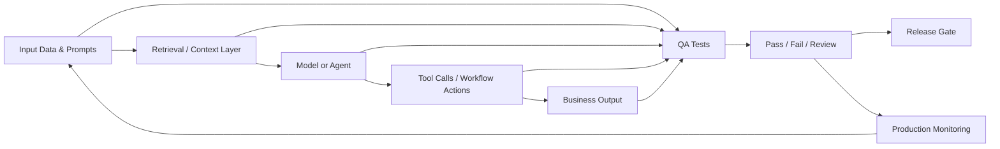

---
title: AI Quality Assurance for Software Teams
repo: ai-business-playbooks
primary_keyword: Machine Learning
secondary_keywords:
- Enterprise AI
- AI Agents
- Business Automation
slug: ai-quality-assurance-for-software-teams
word_count_target: 1200
commit_type: 'feat(ai):'---

# AI Quality Assurance for Software Teams

## Introduction

Machine Learning is now embedded in software delivery pipelines, from code review copilots to test generation, incident triage, and release risk scoring. For software teams, the challenge is no longer whether to use AI, but how to verify that AI outputs are correct, safe, reproducible, and aligned with product requirements. AI Quality Assurance (AI QA) provides the controls, metrics, and test strategy needed to ship AI-enabled features without introducing hidden failures.

This matters especially for teams building Enterprise AI products, AI Agents, and Business Automation workflows. A model that looks accurate in a demo can still break under edge cases, shift behavior after a prompt change, or produce inconsistent results across environments. Traditional QA methods help, but they are not enough on their own because AI systems are probabilistic and often depend on external context, prompts, retrieval layers, and model updates.

## Problem Statement

Software teams usually discover AI quality issues too late. Common failure modes include:

- Hallucinated outputs that pass superficial review but fail in production
- Prompt drift after a small copy change or model upgrade
- Non-deterministic test results that make release gating unreliable
- Weak evaluation coverage for edge cases, bias, or safety violations
- Integration failures between models, APIs, retrieval systems, and orchestration logic

In a conventional application, a function either returns the expected value or it does not. In a Machine Learning workflow, the same input may produce slightly different outputs, and correctness may depend on thresholds rather than exact matches. That means QA needs to test more than code paths. It must validate model behavior, data quality, retrieval relevance, tool execution, and business outcomes.

For example, an AI Agent that drafts customer support replies may be technically functional but still unacceptable if it:
- invents policy details,
- ignores escalation rules,
- fails to cite source documents,
- or generates inconsistent tone across brands.

Without a defined AI QA process, teams end up relying on manual spot checks, which do not scale and do not provide release confidence.

## Solution

A practical AI QA program for software teams should combine software testing, data validation, and model evaluation into one release process. The goal is to measure whether the system is fit for purpose, not just whether it runs.

A strong approach includes these layers:

1. **Define quality criteria before implementation**
   - Accuracy, groundedness, latency, cost, safety, and user satisfaction
   - Acceptance thresholds for each use case
   - Failure severity levels, such as critical, major, and minor

2. **Build an evaluation dataset**
   - Real user prompts, edge cases, and adversarial inputs
   - Gold-standard expected outputs or scoring rubrics
   - Coverage for multilingual, ambiguous, and policy-sensitive scenarios

3. **Automate regression testing**
   - Run the same test suite on every prompt, model, or retrieval change
   - Compare outputs using task-specific metrics
   - Alert when quality drops below thresholds

4. **Separate deterministic and probabilistic checks**
   - Deterministic: schema validation, tool call format, API response structure
   - Probabilistic: relevance, completeness, faithfulness, tone, and usefulness

5. **Monitor in production**
   - Track drift, latency, token usage, fallback frequency, and human escalation rates
   - Sample outputs for human review
   - Feed production failures back into the test set

This approach works well for Enterprise AI because it creates governance and auditability. It also helps AI Agents that call tools or execute workflows, since each step can be validated independently. For Business Automation, the same framework ensures that automated decisions remain within policy and do not silently degrade.

## Architecture or Framework

A reliable AI QA framework usually combines four test planes: data, model, orchestration, and business outcome. Each plane has different metrics and failure modes.

### 1. Data and Prompt QA
Validate the inputs before the model sees them:
- Schema checks for required fields
- Prompt template versioning
- PII redaction and policy filters
- Dataset drift detection

Useful metrics:
- invalid input rate
- prompt template change frequency
- data completeness percentage

### 2. Model QA
Assess output quality from Machine Learning components:
- Exact match for structured tasks
- Semantic similarity for summarization or classification
- Groundedness/faithfulness for RAG-based responses
- Toxicity and policy violation checks

Useful metrics:
- accuracy, precision, recall, F1
- grounded answer rate
- hallucination rate
- refusal correctness rate

### 3. Agent and Workflow QA
For AI Agents and automation systems, validate each action:
- tool selection correctness
- argument validity
- step ordering
- retry behavior
- timeout handling

Useful metrics:
- successful task completion rate
- invalid tool call rate
- average steps per task
- escalation rate to human review

### 4. Business Outcome QA
Measure whether the AI system improves the actual process:
- ticket resolution time
- conversion lift
- analyst throughput
- error reduction
- cost per completed task

Useful metrics:
- SLA adherence
- cost per request
- human override rate
- net savings from automation

A mature implementation uses a release gate. If a model update improves one metric but harms another, the team decides based on business priority. For example, a support assistant may tolerate slightly slower responses if groundedness and policy compliance improve.

## Benefits

A structured AI QA program gives software teams several concrete advantages.

- **Higher release confidence**: Teams can ship prompt changes, model upgrades, and retrieval updates with measurable risk controls.
- **Lower incident rates**: Regression tests catch failures before production, reducing customer-facing errors.
- **Better governance**: Enterprise AI programs need traceability for audits, security reviews, and compliance checks.
- **Faster iteration**: When tests are automated, teams can experiment more often without relying on manual review.
- **Improved user trust**: Consistent outputs, fewer hallucinations, and predictable escalation behavior improve adoption.
- **Cost control**: QA can reveal expensive prompts, unnecessary tool calls, and inefficient workflows.

For leaders, the biggest benefit is not just quality improvement; it is decision clarity. AI QA makes it possible to compare model options, justify deployment decisions, and communicate risk in business terms.

## Challenges

AI QA is difficult because AI systems do not behave like standard software.

### Non-determinism
The same input may produce different outputs across runs, especially with temperature settings, model updates, or different retrieval results. Teams need tolerance-based evaluation rather than exact string matching.

### Evaluation ambiguity
Some tasks have no single correct answer. Summaries, recommendations, and agent responses often require rubric-based scoring, which can be subjective unless carefully defined.

### Test data maintenance
Evaluation sets become stale as products, policies, and user behavior change. Teams must refresh datasets regularly to keep them representative.

### Hidden coupling
A small prompt edit can affect retrieval quality, tool selection, or downstream parsing. This makes root cause analysis harder than in traditional applications.

### Cost and latency
Comprehensive testing can be expensive, especially when using large models for evaluation. Teams should balance test depth with pipeline speed by using smaller models, sampled reviews, or tiered gates.

### Human review bottlenecks
Human evaluation is still necessary for high-risk cases, but it does not scale indefinitely. The solution is to reserve manual review for ambiguous or high-severity outputs while automating routine checks.

## Future Opportunities

AI QA is evolving from ad hoc checks into a dedicated engineering discipline. Several opportunities are emerging:

- **LLM-as-judge systems**: Using models to score outputs against rubrics can accelerate evaluation, especially when paired with calibration and spot checks.
- **Continuous evaluation pipelines**: Instead of testing only before release, teams can evaluate every prompt, model, and retrieval change in near real time.
- **Synthetic test generation**: AI can generate adversarial and edge-case prompts to expand coverage faster than manual authoring.
- **Policy-aware QA**: Enterprise AI platforms will increasingly embed compliance rules directly into test suites.
- **Agent simulation environments**: Teams will use sandboxed environments to test AI Agents against realistic workflows, tool failures, and recovery scenarios.
- **Outcome-based observability**: QA will be tied more tightly to business metrics, not just model metrics, so product teams can see whether quality actually improves operations.

For software leaders, the strategic opportunity is to treat AI QA as part of platform engineering. That means standardizing evaluation tooling, release gates, and monitoring across teams rather than letting each project invent its own process.

## Conclusion

Machine Learning systems require a different quality strategy than traditional software. For software teams, AI Quality Assurance is the discipline that makes Enterprise AI, AI Agents, and Business Automation safe to deploy at scale. The most effective approach is layered: validate inputs, evaluate model behavior, test orchestration, and measure business outcomes.

Teams that invest in AI QA gain more than fewer bugs. They gain faster releases, better governance, and clearer trade-offs between quality, cost, and speed. As AI becomes a core part of software delivery, the teams that win will be the ones that can prove their systems work before users discover the failures.

## Related Reading

- (pending)