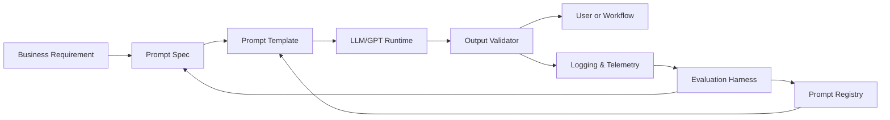

---
title: Prompt Engineering Playbook for CTOs
repo: ai-business-playbooks
primary_keyword: Prompt Engineering
secondary_keywords:
- GPT
- Generative AI
- Enterprise AI
slug: prompt-engineering-playbook-for-ctos
word_count_target: 1200
commit_type: 'feat(ai):'---

# Prompt Engineering Playbook for CTOs

## Introduction

Prompt Engineering is now a core capability for teams building with GPT and other Generative AI models. For CTOs, the question is no longer whether prompts matter, but how to make them reliable, measurable, and safe across products, internal tools, and customer-facing workflows.

A strong prompt strategy can reduce model errors, improve response consistency, and lower operational cost. A weak one creates brittle behavior, hidden quality issues, and unpredictable support burden. This playbook focuses on practical Prompt Engineering for Enterprise AI use cases: customer support copilots, document assistants, workflow automation, and decision-support systems.

The goal is not to write “better prompts” in the abstract. The goal is to build a repeatable system for prompt design, testing, versioning, and governance.

## Problem Statement

Most teams start Prompt Engineering as an ad hoc activity. A product manager writes a prompt, an engineer tweaks it, and the result is copied into a production service. This works for demos, but it breaks down quickly when usage scales.

Common failure modes include:

- Inconsistent outputs across similar inputs
- Prompt drift after small edits
- Hallucinations in Enterprise AI workflows
- Overly long prompts that increase latency and token cost
- No test coverage for edge cases or adversarial inputs
- Lack of ownership between product, engineering, and risk teams

For CTOs, the real problem is operational. Prompt Engineering becomes a hidden dependency that affects reliability, compliance, and customer trust. Without a system, each new use case adds more complexity and more uncertainty.

## Solution

Treat Prompt Engineering as an engineering discipline with clear inputs, outputs, and controls.

A practical approach includes four layers:

1. **Prompt specification**
   - Define task, context, constraints, and success criteria.
   - Separate system instructions from user inputs.
   - Use structured formats where possible, such as JSON schemas or labeled sections.

2. **Prompt templates**
   - Create reusable templates for common GPT workflows.
   - Parameterize variables like customer segment, tone, policy, and output format.
   - Avoid hardcoding business logic inside free-text instructions.

3. **Evaluation harness**
   - Build a test set with representative examples, edge cases, and failure cases.
   - Score outputs for accuracy, format compliance, refusal behavior, and latency.
   - Compare prompt versions before release.

4. **Governance and monitoring**
   - Version prompts like code.
   - Track changes, owners, and rollback paths.
   - Monitor output quality, escalation rates, and user satisfaction in production.

For Enterprise AI teams, the best prompts are usually not the most clever. They are the most testable.

## Architecture or Framework

A CTO-friendly Prompt Engineering framework should connect product requirements to model behavior and production controls.

### Framework components

**1. Business requirement**
- Define the use case: summarization, classification, extraction, drafting, or agentic action.
- Specify the cost of errors. For example, a wrong draft email is low risk; a wrong compliance answer is high risk.

**2. Prompt spec**
- Document the task, audience, tone, constraints, and required output structure.
- Include forbidden behaviors, such as making up policy or inventing citations.

**3. Prompt template**
- Use placeholders for dynamic inputs.
- Example pattern:
  - Role instruction
  - Task instruction
  - Context block
  - Output format
  - Validation rules

**4. Output validator**
- Check format before downstream use.
- Use regex, schema validation, or lightweight classifiers.
- Reject or retry malformed outputs.

**5. Evaluation harness**
- Maintain a prompt test suite in source control.
- Measure:
  - Exact match or semantic accuracy
  - JSON validity rate
  - Hallucination rate
  - Human preference score
  - Median and p95 latency
  - Token cost per task

### Example prompt pattern

For a GPT-based enterprise support assistant:

- System: “You answer only from approved policy and product documentation.”
- Developer: “If information is missing, say you do not know and escalate.”
- User: “Can I export audit logs for the last 90 days?”
- Expected output: short answer, policy reference, next action, escalation trigger

This structure reduces ambiguity and makes evaluation possible.

## Benefits

A disciplined Prompt Engineering program creates measurable business value.

### Higher reliability
Structured prompts and validators reduce malformed outputs and policy violations. Teams can keep response quality stable as use cases expand.

### Faster iteration
Prompt templates and test suites shorten the cycle from idea to production. Engineers can ship changes with confidence instead of relying on manual spot checks.

### Lower cost
Better prompts often reduce token usage by removing unnecessary context and repeated instructions. That matters for high-volume GPT workloads.

### Better governance
Versioning, ownership, and logs give security, legal, and compliance teams visibility into how Enterprise AI systems behave.

### Improved user experience
Clear prompts produce clearer outputs. Users get responses that are more consistent in tone, format, and usefulness.

### Easier scaling across teams
Once a prompt library exists, product teams can reuse proven patterns for summarization, extraction, classification, and agent workflows.

## Challenges

Prompt Engineering is useful, but it has real constraints.

### Model variability
The same prompt can behave differently across model versions, temperature settings, or context lengths. CTOs need regression testing every time a model changes.

### Hidden prompt debt
As teams add exceptions, guardrails, and special cases, prompts become long and fragile. At some point, orchestration logic should move into code, policies, or retrieval layers.

### Evaluation is expensive
Human review is still necessary for high-stakes Enterprise AI use cases. Automated metrics help, but they do not fully capture correctness, safety, or business fit.

### Security risks
Prompts can be manipulated through prompt injection, especially when the model reads external content. Mitigations include input sanitization, tool scoping, and strict separation of instructions from retrieved text.

### Over-reliance on prompts
Prompt Engineering cannot replace product design. If the task requires deterministic behavior, a rules engine, workflow system, or fine-tuned classifier may be a better fit than a large prompt.

### Organizational friction
Different teams often optimize for different outcomes:
- Product wants speed
- Engineering wants reliability
- Legal wants control
- Operations wants observability

The CTO must align these priorities with a shared evaluation standard.

## Future Opportunities

Prompt Engineering will keep evolving as models and tooling mature.

### Prompt version control and registries
Expect more teams to manage prompts like application code, with reviews, changelogs, canary releases, and rollback support.

### Automated prompt optimization
Tools will increasingly suggest improved prompts based on evaluation data, reducing manual trial-and-error for GPT workflows.

### Dynamic prompts with retrieval
Instead of static instructions, prompts will be assembled at runtime from policy, user context, and relevant documents. This improves accuracy but increases orchestration complexity.

### Agentic systems
As Generative AI systems become more agent-like, prompts will need to coordinate planning, tool use, memory, and safety constraints. Prompt Engineering will extend into agent policies and tool contracts.

### Stronger enterprise controls
Enterprise AI platforms will add policy enforcement, audit trails, and output governance directly into the prompt lifecycle. This will help regulated industries adopt AI with less risk.

### Multimodal prompting
Text-only prompts will expand to include images, tables, and structured data. CTOs should prepare for prompts that direct reasoning across multiple input types.

## Conclusion

Prompt Engineering is not a writing exercise. For CTOs, it is an operating model for building dependable GPT and Generative AI systems inside the enterprise.

The winning approach is simple to state and hard to execute: define the task precisely, template the prompt, validate the output, measure performance, and govern every change. When done well, Prompt Engineering improves quality, reduces cost, and makes Enterprise AI safer to scale.

The practical next step is to create a prompt registry, a shared evaluation set, and a release process for prompt changes. That foundation turns prompt work from tribal knowledge into a repeatable capability.

## Related Reading

- (pending)