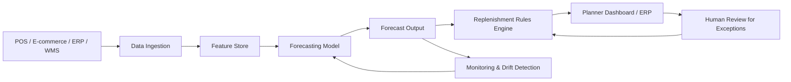

---
title: AI Inventory Forecasting for Retail
repo: ai-business-playbooks
primary_keyword: Business Automation
secondary_keywords:
- Machine Learning
- Enterprise AI
- AI Agents
slug: ai-inventory-forecasting-for-retail
word_count_target: 1200
commit_type: 'feat(ai):'---

# AI Inventory Forecasting for Retail

## Introduction

Retail inventory is a balancing act: too much stock ties up cash and creates markdown risk, while too little stock causes lost sales and frustrated customers. **Business Automation** can improve this balance by turning inventory forecasting from a manual spreadsheet exercise into a repeatable, data-driven system.

For founders and technology leaders, the business case is straightforward. Better forecasts reduce stockouts, lower holding costs, improve replenishment accuracy, and free planners to focus on exceptions rather than routine calculations. When paired with **Machine Learning**, **Enterprise AI**, and **AI Agents**, inventory forecasting becomes more responsive to demand shifts, promotions, seasonality, and supply constraints.

This article outlines how to design and implement AI inventory forecasting for retail with practical steps, measurable outcomes, and an architecture that can fit both mid-market and enterprise environments.

## Problem Statement

Traditional forecasting methods in retail often fail for three reasons.

First, demand is not stable. Sales are affected by promotions, holidays, weather, local events, competitor pricing, and product lifecycle changes. A simple moving average or rule-based reorder point cannot capture these patterns well.

Second, retail data is fragmented. Point-of-sale systems, e-commerce platforms, warehouse management systems, supplier feeds, and promotional calendars often live in separate tools. Forecasting teams spend more time reconciling data than generating decisions.

Third, planning is often reactive. Buyers and planners review inventory weekly or monthly, which is too slow for fast-moving categories. By the time a human notices a trend, the stockout or overstock has already happened.

The operational impact is measurable:
- Stockout rates rise, reducing revenue and customer trust.
- Excess inventory increases carrying costs and markdowns.
- Forecast bias creates chronic over-ordering or under-ordering.
- Planning teams lose time on manual analysis instead of strategic decisions.

Retail leaders need a system that can forecast at the SKU-store-day level, update frequently, and support business rules for replenishment.

## Solution

The solution is an AI-powered forecasting pipeline that combines historical sales data, contextual features, and automated decisioning.

At a minimum, the system should:
1. Ingest sales, inventory, pricing, promotion, and supply data.
2. Build forecasts at the right granularity, such as SKU-store-week or SKU-channel-day.
3. Generate replenishment recommendations based on lead time, safety stock, and service-level targets.
4. Surface exceptions for planners through dashboards or workflow tools.
5. Continuously retrain and monitor model accuracy.

A practical **Business Automation** approach is to separate forecasting from ordering. The model predicts demand; downstream rules convert the forecast into purchase orders or transfer requests. This keeps the system auditable and easier to govern.

Recommended model approaches include:
- Gradient-boosted trees for structured retail data and strong baseline performance.
- Time-series models such as Prophet or ARIMA for simpler categories.
- Deep learning models like temporal fusion transformers for large catalogs and complex seasonality.
- Hierarchical forecasting when you need consistency across SKU, category, and region levels.

For many retailers, the best first step is not a highly complex model. It is a reliable pipeline that improves forecast accuracy by 10–20% versus the current baseline and reduces manual planning effort by 30–50%.

## Architecture or Framework

A production-grade retail forecasting system should be designed as a layered framework.

### 1. Data ingestion layer
Collect data from:
- POS transactions
- Inventory snapshots
- Purchase orders and supplier lead times
- Pricing and promotion calendars
- Product master data
- Weather or local event feeds where relevant

Use batch ingestion for daily forecasting and streaming ingestion for near-real-time categories such as convenience or grocery.

### 2. Feature engineering layer
Create features that explain demand:
- Lagged sales
- Rolling averages
- Promotion flags
- Price changes and discount depth
- Holiday indicators
- Stockout indicators
- Lead time variability
- Product lifecycle stage

This layer is where **Machine Learning** usually wins over manual methods. Good features often matter more than model complexity.

### 3. Forecasting model layer
Train models by category or demand pattern:
- Stable, high-volume SKUs: tree-based or statistical models
- Seasonal products: models with holiday and calendar features
- New products: similarity-based forecasting or category priors
- Long-tail SKUs: pooled models with hierarchical signals

If the organization has a large catalog and multiple channels, an **Enterprise AI** platform should manage model versions, data lineage, and access control.

### 4. Decisioning layer
Convert forecasts into actions:
- Reorder quantities
- Safety stock levels
- Transfer recommendations between stores
- Markdown triggers for slow-moving inventory

This layer can use business rules plus optimization. Forecasts alone do not solve inventory; decision logic closes the loop.

### 5. Human-in-the-loop layer
Use **AI Agents** to assist planners with exception handling. For example, an agent can:
- Summarize SKUs with unusual forecast variance
- Explain why a forecast changed
- Draft replenishment notes for a buyer
- Flag supplier delays that affect order timing

This is especially useful for enterprise teams that need transparency and workflow support rather than black-box automation.

### 6. Monitoring layer
Track:
- Forecast accuracy by SKU, store, and category
- Bias and error distribution
- Stockout rate
- Inventory turnover
- Fill rate
- Markdown percentage
- Planner override rate

A forecast model that looks accurate overall but fails on top-selling SKUs is not acceptable. Monitoring should be segmented by business impact, not only by aggregate error.

## Benefits

AI inventory forecasting for retail delivers both financial and operational gains.

### Reduced stockouts
Improved demand prediction helps stores keep core items available, which protects revenue and customer satisfaction.

### Lower carrying costs
Accurate forecasts reduce excess inventory and free working capital. This is especially valuable for seasonal or fashion-driven assortments.

### Better planning productivity
Automated forecasting reduces the time planners spend on manual spreadsheet updates, allowing them to focus on supplier negotiations, assortment strategy, and exception management.

### Faster response to demand shifts
If promotions, weather, or market changes affect demand, the system can update forecasts more frequently than human planning cycles.

### Improved cross-functional alignment
Forecasts become a shared source of truth for merchandising, supply chain, finance, and operations. That reduces conflicting assumptions and improves decision speed.

### Stronger enterprise governance
With **Enterprise AI**, leaders can enforce model approvals, audit trails, and role-based access. That matters in organizations where inventory decisions affect multiple business units and regions.

## Challenges

Retail forecasting is not trivial. Leaders should plan for these issues early.

### Data quality and completeness
Missing sales records, inconsistent product codes, and inaccurate stock snapshots can distort the model. A strong master data process is essential before model deployment.

### Stockout bias
When an item is out of stock, observed sales no longer reflect true demand. The model must detect and correct for censored demand, or it will learn the wrong pattern.

### Cold-start products
New SKUs have limited history. Forecasting must rely on category-level patterns, product attributes, and similarity to comparable items.

### Organizational adoption
Planners may distrust model outputs if the system cannot explain changes. Adoption improves when forecasts come with reason codes, confidence intervals, and clear override workflows.

### Integration complexity
Retail environments often include legacy ERP, WMS, and POS systems. Integrating AI into these workflows requires careful API design, batch jobs, and error handling.

### Model drift
Demand patterns change with pricing strategies, economic conditions, and assortment shifts. Without retraining and drift monitoring, accuracy will degrade over time.

A practical mitigation strategy is to start with one category, one region, or one channel, then expand after proving impact.

## Future Opportunities

The next phase of AI inventory forecasting will be more autonomous and more connected to execution.

### Autonomous replenishment
Forecasts will increasingly feed optimization engines that create purchase orders automatically within policy thresholds. Human review will focus on exceptions rather than routine approvals.

### Multi-agent planning workflows
**AI Agents** can coordinate tasks across forecasting, procurement, and logistics. One agent can monitor demand anomalies, another can check supplier capacity, and a third can draft action recommendations for planners.

### Causal forecasting
Retailers will move beyond correlation-heavy models toward causal models that estimate the true impact of promotions, price changes, and external events. This will improve decision quality for merchandising teams.

### Real-time decisioning
As infrastructure matures, forecasting will shift from daily batch jobs to near-real-time updates for fast-moving categories. This is especially relevant for omnichannel retail.

### Better scenario planning
Retail leaders will use AI to simulate what happens if promotions change, suppliers delay shipments, or demand spikes in specific regions. This supports more resilient inventory strategy.

## Conclusion

AI inventory forecasting for retail is one of the most practical applications of **Business Automation**. It directly improves service levels, inventory efficiency, and planning speed while creating a more disciplined decision process.

The best implementations combine **Machine Learning** for prediction, **Enterprise AI** for governance and scale, and **AI Agents** for exception handling and workflow support. Success depends less on exotic models and more on strong data foundations, clear decision rules, and measurable operating metrics.

For founders and CTOs, the right starting point is a narrow pilot with a clear business target: reduce stockouts, improve forecast accuracy, or lower excess inventory in one category. Once the pipeline is proven, it can expand across channels, regions, and product families with much lower risk.

## Related Reading

- (pending)