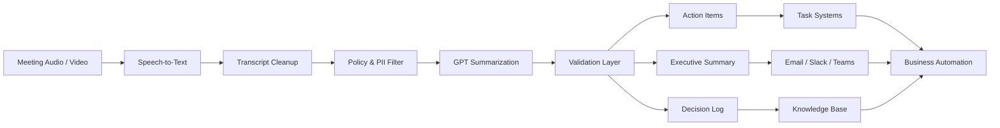

---
title: AI Meeting Summarization for Executives
repo: ai-business-playbooks
primary_keyword: Generative AI
secondary_keywords:
- GPT
- Enterprise AI
- Business Automation
slug: ai-meeting-summarization-for-executives
word_count_target: 1200
commit_type: 'feat(ai):'---

# AI Meeting Summarization for Executives

## Introduction

Executives spend a large share of their week in meetings, yet the value created by those meetings often disappears into scattered notes, action items, and memory gaps. **Generative AI** can turn meeting transcripts into concise executive summaries that capture decisions, risks, owners, and next steps with far less manual effort.

For leadership teams, the goal is not to produce “pretty notes.” The goal is to create a reliable workflow that supports faster decision-making, better follow-through, and cleaner visibility across the business. With the right design, AI meeting summarization can become a repeatable layer of **Enterprise AI** that feeds dashboards, project trackers, and internal knowledge systems.

This article explains how to implement AI meeting summarization for executives using **GPT**, where it fits in a broader **Business Automation** strategy, and what trade-offs matter when deploying it in a real organization.

## Problem Statement

Executive meetings are information-dense and time-constrained. A single weekly leadership meeting may include updates from finance, sales, product, operations, and HR. By the end of the call, the organization needs more than a transcript. It needs:

- a short summary of decisions
- a clear list of action items
- named owners and deadlines
- unresolved issues and risks
- follow-up context for absent stakeholders

Manual note-taking does not scale well. Different people summarize differently, and important details are often lost. Transcripts alone are also insufficient because they are too long for quick review and too noisy for action tracking.

Common failure modes include:

1. **Inconsistent summaries** across teams and departments.
2. **Delayed follow-up** because action items are buried in notes.
3. **Low adoption** when summaries are too verbose or too generic.
4. **Compliance concerns** when sensitive meeting content is copied into unmanaged tools.
5. **Poor integration** with task systems like Jira, Asana, or Microsoft Planner.

This is where **Generative AI** becomes useful: not as a replacement for human judgment, but as a structured summarization layer that converts conversation into operational output.

## Solution

A practical AI meeting summarization workflow should be designed around three outputs:

- **Executive summary**: 5–10 bullet points capturing the main outcomes.
- **Decision log**: what was approved, rejected, or deferred.
- **Action register**: owner, task, due date, dependency, and confidence level.

The best implementation pattern is a pipeline, not a single prompt. A strong workflow typically includes:

1. **Audio capture and transcription**
   - Use a meeting platform or speech-to-text service to produce a transcript.
   - Prefer diarization so speakers are labeled.
   - Store timestamps for traceability.

2. **Transcript cleanup**
   - Remove filler words, repeated phrases, and obvious transcription errors.
   - Normalize names, product terms, and acronyms using a glossary.

3. **Summarization with GPT**
   - Use a structured prompt that requests specific sections.
   - Ask for JSON or markdown output so downstream systems can parse it.
   - Instruct the model to separate facts from inferred items.

4. **Validation and human review**
   - Flag uncertain action items.
   - Require a quick approval step for executive-facing summaries.
   - Compare output against the transcript for critical decisions.

5. **Distribution and automation**
   - Send summaries to email, Slack, Teams, or a knowledge base.
   - Create tasks automatically in project tools.
   - Archive summaries with metadata for search and retrieval.

A useful prompt pattern for **GPT** is:

- summarize only what was explicitly discussed
- identify decisions, owners, deadlines, and risks
- return a fixed schema
- mark uncertain items as “needs review”

This reduces hallucination and makes the output easier to operationalize.

## Architecture or Framework

Below is a reference architecture for executive meeting summarization in an **Enterprise AI** environment.

### Recommended framework components

**1. Ingestion layer**
- Connect to Zoom, Microsoft Teams, or Google Meet.
- Trigger processing after the meeting ends.
- Capture metadata: meeting title, attendees, date, department, and confidentiality level.

**2. Transcript processing layer**
- Use a transcript cleaner to segment by speaker and topic.
- Add domain-specific dictionaries for product names, client names, and internal acronyms.
- Split long meetings into chunks before summarization if the transcript exceeds model limits.

**3. Policy and security layer**
- Apply PII redaction for customer names, compensation data, or legal topics.
- Enforce role-based access controls.
- Log prompts and outputs for auditability.

**4. Summarization layer**
- Use **Generative AI** models such as GPT for:
  - meeting summaries
  - decision extraction
  - action item extraction
  - risk identification
- Prefer structured outputs such as:
  - `summary`
  - `decisions`
  - `actions`
  - `risks`
  - `open_questions`

**5. Validation layer**
- Use rules to check for missing owners, impossible dates, or duplicated tasks.
- Optionally score confidence by comparing extracted items against transcript evidence.
- Route low-confidence items to a human reviewer.

**6. Automation layer**
- Push approved action items into project management tools.
- Notify participants through Teams or Slack.
- Store summaries in an internal wiki or searchable repository.

### Practical implementation choices

- If meetings are short, a single-pass GPT summary may be enough.
- If meetings are long or highly regulated, use a two-step process:
  1. extract structured facts
  2. generate the executive narrative from those facts

This two-step approach improves consistency and reduces hallucinations. It also works better when multiple departments need the same meeting to be summarized in different formats.

## Benefits

AI meeting summarization creates value in several measurable ways.

### 1. Faster executive alignment
Executives can review a 1-page summary instead of replaying a 60-minute meeting. This improves decision velocity and reduces unnecessary follow-up calls.

### 2. Better accountability
Action items with owners and deadlines are easier to track when they are automatically extracted and pushed into task systems. This supports **Business Automation** by reducing manual coordination.

### 3. More consistent knowledge capture
A standardized summary format ensures that every meeting produces the same core artifacts. That consistency matters when leadership teams grow or when multiple assistants are involved.

### 4. Improved searchability
When summaries are stored in a knowledge base, teams can search by topic, person, product, or decision. This turns meetings into reusable organizational memory.

### 5. Lower administrative overhead
Instead of relying on manual note-taking, teams can reassign time to higher-value work. For executive assistants and operations teams, this can be a major efficiency gain.

### 6. Better cross-functional visibility
A finance leader, product leader, and operations leader can all read the same summary and quickly understand what changed. That shared context reduces misalignment.

For organizations already investing in **Enterprise AI**, meeting summarization is often one of the fastest use cases to deploy because it has a clear workflow, clear ROI, and a direct link to operational execution.

## Challenges

Despite the promise, implementation is not trivial.

### Accuracy and hallucination
GPT can summarize well, but it can also infer details that were never stated. This is dangerous for decisions, deadlines, and commitments. The fix is structured prompting, transcript grounding, and human review for critical meetings.

### Speaker attribution
If the transcript does not reliably identify speakers, the model may assign action items to the wrong person. Diarization quality matters, especially in meetings with overlapping speech.

### Confidentiality and compliance
Executive meetings often contain sensitive financial, legal, or personnel information. Organizations must control where transcripts are stored, who can access them, and whether external model providers are allowed to process the data.

### Prompt drift and inconsistency
If different teams write different prompts, the summaries will vary. Standardized templates and versioned prompts are necessary for governance.

### Integration complexity
The real value comes from connecting summaries to systems like Jira, Asana, ServiceNow, or CRM platforms. Without integration, the output remains a document instead of becoming part of **Business Automation**.

### Adoption
Some executives prefer very short summaries, while others want more context. If the format is not tuned to leadership preferences, the tool will be ignored. Adoption improves when summaries are concise, predictable, and delivered where leaders already work.

## Future Opportunities

AI meeting summarization is evolving from simple note generation into a broader decision-support layer.

### Multimodal meeting intelligence
Future systems will combine audio, video, slides, chat, and calendar context. This will let **Generative AI** produce richer summaries that understand what was said, what was shown, and what was shared in chat.

### Personalized executive briefs
Instead of one generic summary, systems will generate role-specific outputs:
- CEO brief: strategic decisions and risks
- CFO brief: budget and forecast impact
- COO brief: operational blockers and dependencies

### Automated follow-through
Summaries will increasingly trigger downstream actions automatically:
- create tasks
- schedule follow-up meetings
- update project status
- notify stakeholders of decisions

### Retrieval-augmented meeting memory
Meeting summaries will be linked to prior decisions, strategy docs, and project records. This will help GPT produce summaries that reference historical context without relying on long transcripts alone.

### Governance-aware summarization
As **Enterprise AI** matures, organizations will want summaries that include policy checks, sensitive-topic handling, and approval workflows built into the pipeline.

### Meeting analytics
Beyond summarization, organizations will analyze recurring themes:
- decision latency
- meeting load by team
- unresolved action items
- topic frequency across leadership forums

This turns meetings from a time sink into a measurable management system.

## Conclusion

AI meeting summarization for executives works best when it is treated as an operational pipeline, not a novelty feature. **Generative AI** can reliably convert transcripts into summaries, decisions, and action items when paired with structured prompts, validation rules, and workflow integration.

For founders and technology leaders, the practical path is clear: start with one recurring executive meeting, define a strict output schema, use GPT for extraction and summarization, and connect the result to task and knowledge systems. That approach delivers immediate value while creating a foundation for broader **Enterprise AI** and **Business Automation** initiatives.

The organizations that succeed will not be the ones with the longest transcripts. They will be the ones that turn meetings into action with the least friction.

## Related Reading

- (pending)